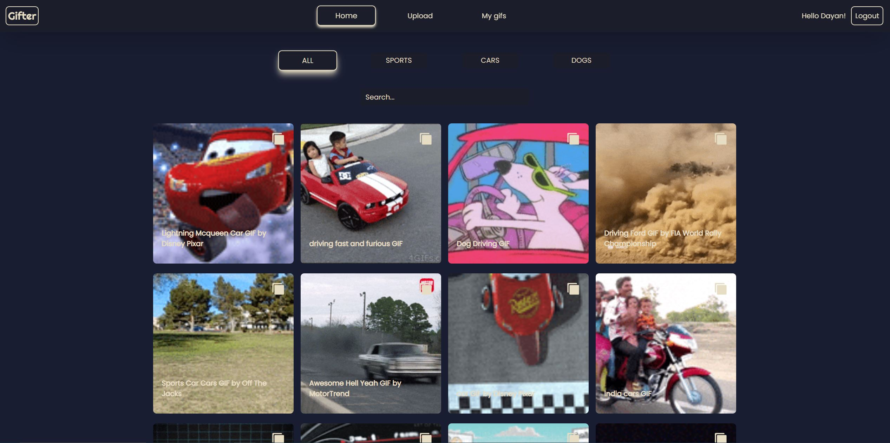
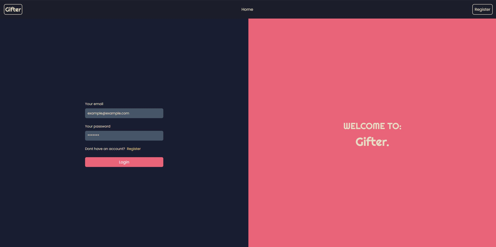
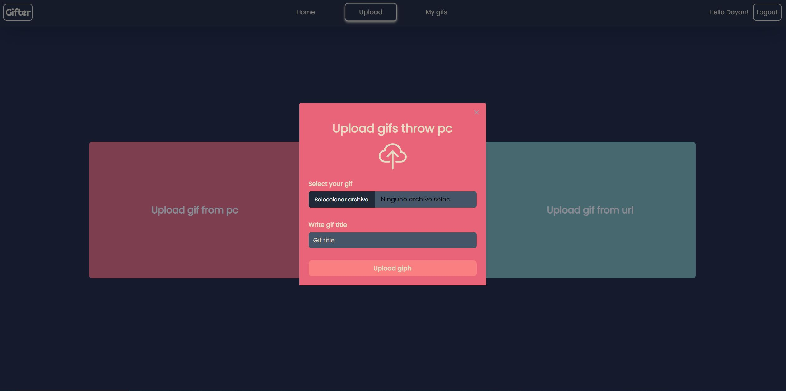
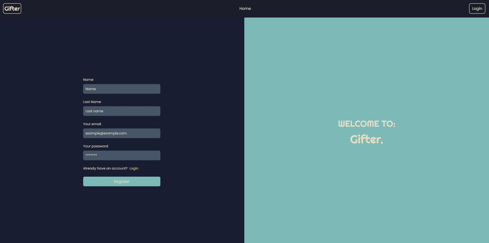
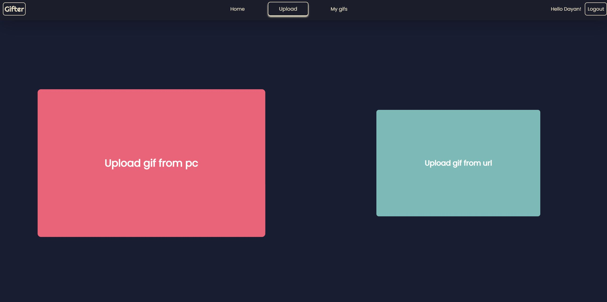

# GIPH-APP-FRONT

### MEDIA

---

---

---

---

---

### Clone the repository:

https://github.com/Psicowar/GIPH-APP-FRONT

## Install required dependencies:

npm install

## Run:
npm run dev

---

### Project Description

Gif page to upload, search, edit and delete gifs

---
### Used Technologies
React

Javascript

Html

Tailwind

---
### Used Libraries
Flowbite-react

React-hook-form

React-loader-spinner

React-router-dom

Sweetalert2

React-hook-form

React-icons

React-Lazy-load-image-component

Axios

Vite

---

### Used IDE

https://code.visualstudio.com/

---
## Autors

<li>Dayan Álvarez Martínez</li>
    